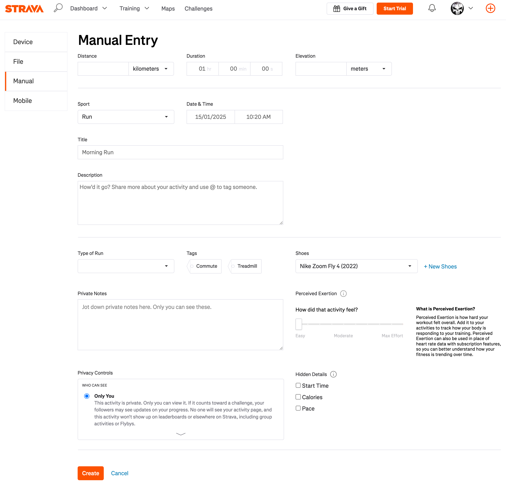

# The Activity Tracker

As a personal trainer and a hobby triathlete I always trying to keep track of my activities through popular platforms such as
Strava or Garmin Connect. As the these platforms improved over the years more and more details, insights became available foruserslike myself. The accessible data with regards to one's activity sometimes it is a bit overwhelming and pointles because as an avarage person many of those metrics will not matter for us. Within the details it's easy to lose the focus on the fundemantal goal that we just want to be active and we would like to record it in a simple, not confunsing way. This was how the idea of my fith project for the Code Institute course was born.

## The vision

Strava and Garmin Connect are the Apple and Microsoft of activity tracking in these days, so using their products and services I tried follow their example but I imagined a rather simplified version. Both platforms could provide libraries and API's for developers.
<https://developers.strava.com/>
<https://developer.garmin.com/gc-developer-program/activity-api/>
However looking into more Strava's API Agreement seems complex, restrictive and me question that for something simple that I want do I really need all of that. Garmin was a different story an application had to be sent to them in order to gain acces their libraries, APIs. This application of mine was rejectet pretty swiftly. After this I just tied to focus on what I want to create.
Started to go through the user's journey of an activity platform and outlined the essential user stories.

At next I visualized a user friendly interface where all the required functions are easy to spot and use.

This was my idea that I proudly presentet to my tutor. However some research and meetings with my tutor made me realise I don't have the techniqual skills, experience or time to create something that like the initial idea was, plus to launch an MVP product I don't even need all of that. Considering all these details I narrowed down the scope of the project to aim for an MVP outcome creating a simple user interface much like Strava  and Garmin has on their platform . It is basically a form with different data fields that the user can create, save, modify, delete.

### User Experience

#### First time visitor goals

+ As a first time visitor the goal and the purpose of the website is easily understandable.

+ As a first time visitor I can easily navigate through the page and locate functions.

#### Returning visitor goals

+ After some contemplation as a returning visitor to the website I can find and carry on a registration.

+ As a registered user I can log in to my account, where my data and details are stored securely.

+ As a logged in user I can choose from different types of activities.

+ As a logged in user I can save my chosen actyvity type, date, duration.

#### Frequent user goals

+ As a frequently returning user I can see my past activities on a list.

+ As a frequently returning user I can modify details of past activities or I can delete past activities.

### Technologies Used

#### Languages Used

+ HTML

+ CSS3

+ Javascript

+ Python

#### Frameworks, Libraries & Programs Used

1. Bootstrap

2. Django Rest Framework

3. Git

+ Git was used to commit and push the codes.

4. GitHub

+ Github was used to store the project after being pushed.

5. Pexels.com

+ Pexels was used to download pictures for background and illustrations.

6. Balsamiq.com

+ Balsamiq platform was used to draw wireframes nad visualise pages.

7. React

### Features

#### Existing Features

+ Logo, branding

Upon opening the page in the browser next to the name of the website the logo is positioned in the felt side of the navbar. Dynamic and reflecting the colour scheme of the site

+ Activity types list

 The user can choose th etype of activity from a scroll down list. The list is not limited to tha existing choices, furhter activities can be added.

+ Date of activity

The user can set the date in the past of the recorded activity.

+ Activities list

The user can set the duration of the recorded activity in a format of hh:mm:ss.

+ Activities list

The user can see on a list her/his past activities.

+ Result fields

There are three fields which are clearly indicating the place of the expected result, depending on, in which value is the user interested.

+ User guide

The user guide can be found at the bottom of the page in the footer section. Gives a brief, clear explanation on how to fill out the forms.

#### Features left to implement

+ To improve user experience HTML Web storage could be used to store the previusly input values.

* A unit conversion feature could be added to change from metric to imperial and back.
