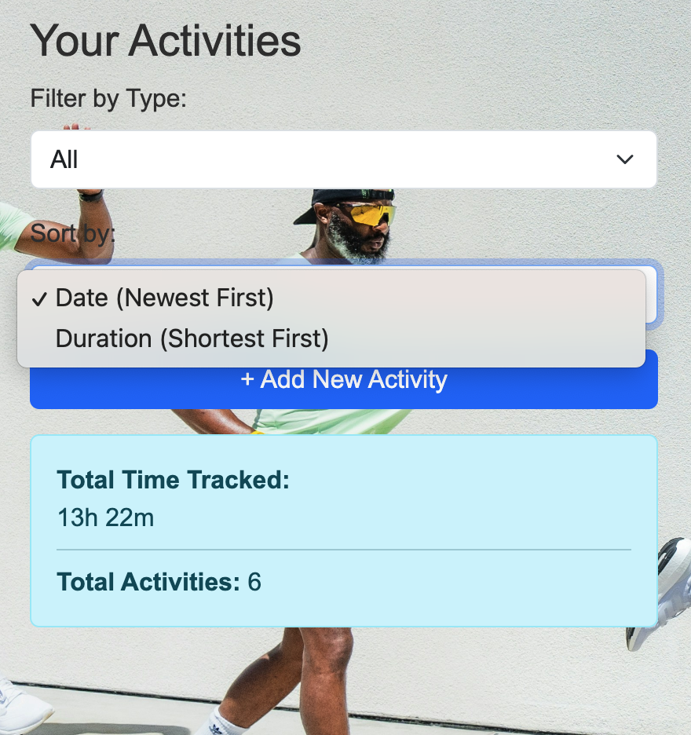
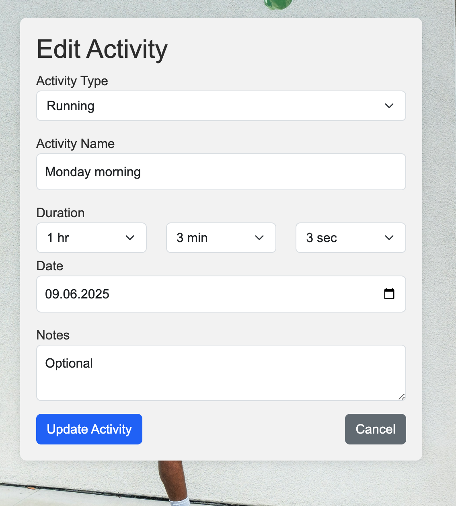
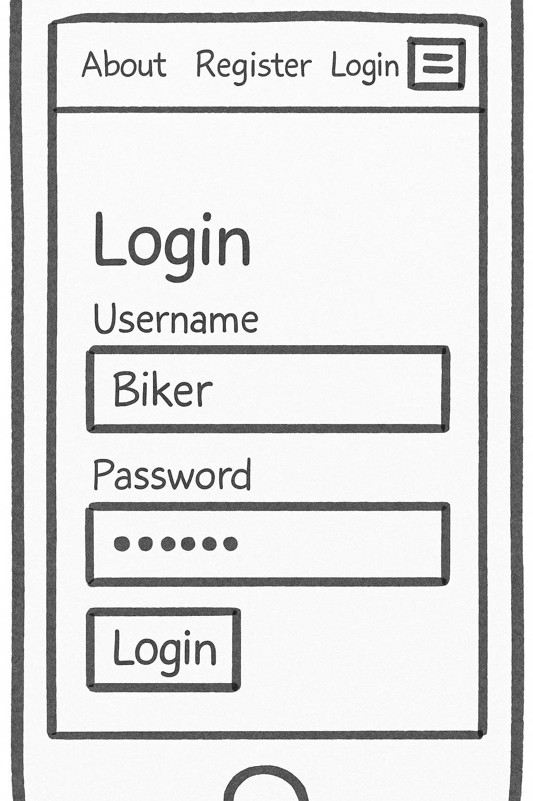

# 🏃‍♂️ Activity Tracker – A Full Stack MVP for Simplified Activity Logging


“Not all metrics matter. Sometimes, the best data is the simplest.”  To visit the deployed version of the Activity Tracker [click here](https://reactivity-789dd5d26427.herokuapp.com/).

## 1. Purpose

The Activity Tracker saves the key details of a training or recreactional activity  in the most simple, straightforward way. It is useful for anyone who wants to record their sport or recreational activities, and wants to monitor their progress over time. Because of it's simplicity it doesn't create an overwhelming feeling in the user caused by too much and complicated data, instead brings back the focus on the key thing, the training itself. There are far more advanced applications/ platforms out there, they provide a lot more details, which eventually becomes the problem. The usres will focus much more on certain metrics and when some targets are not met it will have a negative impact on the users' behavoiur, motivation. Certanly when one is competeing for her/his country or doing competitive sports for living all the data is needed to make improvements. But for the majority few key details are enough to be healthy and create good habits. The Activity Tracker is a full stack web application and was built using Django, Python, Bootstrap, PostgreSQL, React.


## 2. Features

- **Navbar** Clean, consitent navbar across the pages. Clicking on the icon/logo directs the user back to the main page. 


- **About Field** The About (Us) page gives a short description for the visitor of what the application does.


- **Registration Validation** The registration form is using standard validations to highlight any error for the user in case of wrong or missing details.


    - **Existing User**: Registration will not proceed when a new user selects a previously saved user name.

    


    - **Missing Password** The registration will not proceed if one of the passwords is missing.

    


    - **Mismatched Passwords** The registration will not proceed if the two passwords that the user puts in do not match fully.

    


    - **Missing Username** The registration will not go ahead if the username is missing.

    


    - **Missing Email** The registration will not go ahead if the email is missing.

    

---
- **Password Visibility Toggle** In case the user is not sure about the password input or wants to check them the password toggle feature makes the hidden characters visible.    The feature is available both on the Registration and on the Login form.


---
- **Login Validation**

  - **Missing Password** Previously registered user won't be able to log in if the password is missing.

  


  - **Missing Username** Previously registered user won't be able to log in if the username is missing.

  


  - **Invalid Details** Previously registered user won't be able to log in if the username and/or password is not correct.

  

---
- **Dashboard** The Dashboard is the where the main functionalities can be found, the dashboard itself is the activity tracker. Simple design both for desktop and for mobile.


Mobile version (Redmi Note 13)


---
- **Dashboard Functions**

- **Activity Filter by Type**  
  Users can quickly filter activities by type (e.g., Running, Swimming, Gym).  
  

- **Activity Filter by Date (Newest First)**  
  Sorts the activities to display the most recently added entries at the top of the list.  
  

- **Activity Filter by Duration (Shortest First)**  
  Allows users to sort activities based on their tracked time, starting with the shortest duration.  
  

- **Total Time Tracked**  
  A dynamic field that shows the cumulative duration of all logged activities, helping users see their overall time investment.  
  

- **Total Activities**  
  Displays the total number of activities logged, giving users a quick summary of their productivity.  
  

- **Scrollable List of Saved Activities**  
  Previously saved activities are displayed in an easy-to-navigate scrollable list for convenient browsing and review.  
  

- **Add New Activity Button**  
  A prominent button that allows users to quickly log new activities, including relevant details such as title, duration, and type.  
  

---
- **Add New Activity Form** The "Add New Activity" form enables users to log new activities with structured input and built-in validation to ensure data quality. Key components include:

  - **Activity Type Selector**  
  A dropdown list allowing users to select a category or type of activity (e.g., Running, Swimming, Hiking).  
  _Validation_: The user must select a valid activity type before submission.  
  

- **Activity Name Field (Mandatory)**  
  A required text input for naming the activity, ensuring all entries are clearly labeled.  
  _Validation_: This field cannot be left blank.  
  

- **Activity Duration Picker (Mandatory)**  
  Allows users to input the time spent on an activity using a time selector.  
  _Validation_: A value of `00:00:00` is not accepted.  
  

- **Activity Date Picker (Mandatory)**  
  Users select the date the activity was completed.  
  _Validation_: Future dates are disabled and cannot be selected.  
  

- **Notes Field (Optional)**  
  A free-text area for users to include additional information or context about the activity.  
  _Validation_: This field is optional and does not require input.  
  


---
-**Edit Activity** The user has the option to edit, update previously saved activities. The same validations apply for the input fileds in the New Activity form.




-**Delete Activities** The user has the option to delete previously saved activities from the list. To proceed the user has to confirm the deletion of the activity.


---
-**Profile Page** The Profile page allows users to view and update their personal account details in a user-friendly form.
_Validation_: Validation applies to the Username and to the Email address fields.
  Key elements include:

- **Username (Pre-Populated)**  
  Displays the user’s unique username, which is pre-filled.  

- **Email (Pre-Populated)**  
  Shows the registered email address of the user, pre-filled in the form for reference.  

- **First Name (Editable)**  
  Allows users to enter or update their first name. This field is optional but enhances personalization.  

- **Last Name (Editable)**  
  Allows users to enter or update their last name. Optional, but contributes to a more complete profile. 

- **Update Button**  
  Submits the updated profile information and provides feedback on success or validation errors.  
  


## 3.  Requirement Gathering and Planning

###  Project Summary
The activity tracker app was designed to help users record and monitor how they spend their time through a simple and user-friendly interface.
The goal of this project was to build an intuitive activity tracker app that allows users to log, manage, and review their daily/weekly activities. 
Planning focused on user needs such as accessibility, ease of use, and data accuracy.”
Platforms like [Strava](https://developers.strava.com/docs/reference/) and [Garmin](https://developer.garmin.com/gc-developer-program/activity-api/) are the giants. 
I drew inspiration from them but opted to avoid the complexities of their APIs and licenses. Both of those well known platforms at their core have the same functionality that I wanted to have for the users.

**Strava**


**Garmin**


The main difference is that while they treat this feature as an add on or extra, I want this feature to be the core of an activity tracker.
In case of future development other functionalities would be added to this and not the other way round.

To keep it simple I designed a **simplified user interface** to support key use cases:
-  Log activities with type, name, date, and duration
-  View past records in a clean dashboard
-  Edit or delete records anytime


---

###  Stakeholders & Target Users
- Primary Users: Individuals who want to track time spent with physical activities, training. 
  Individuals who need a simple tool to keep up their healthy habits regardelss of age, fitness level or sport background
- Stakeholders: Product owner, development team, end users.
---
###  Functional Requirements
- Users can log new activities with name, type, duration, and date.
- Users can edit or delete saved activities.
- Filtering and sorting options are available on the dashboard.
- Secure login and registration are required to access personal data.
---
###  Non-Functional Requirements
- Application must respond in under 2 seconds.
- Fully responsive UI.
- Secure user authentication.
- Validation on both frontend and backend.
---
###  Planning Tools & Visuals
- ERD (Entity Relationship Diagram):  
  

---
- Github Projects:  
  [Link to Planning Board](https://github.com/users/RayPT808/projects/16/views/2)

---

- User Flow:  

  1\. Regitration

  

  2\. Login

  

  3\. Profile Update

  

  4\. Add Activity

  

  5\. Edit Activity

  

  6\. Delete Activity

  


---

- User Interface Design

  - Computer Wireframes : The wireframes I created illustrate the core user interface and functionality of Activity Tracker from both a desktop/laptop perspective and a mobile perspective. These visual guides serve as a blueprint for the design and structure of the application, ensuring a cohesive and intuitive user experience. The aim was to provide better understanding of the initial layout and illustrate the user facing fields and structure.

**Registration**


**Login**


**Dashboard, Add Activity**


**Edit Activity**


---
- Mobile Wireframes: Mobile wireframes were created to ensure responsive design across devices, focusing on a clean and simplified layout for optimal usability on smaller screens.

**Login**


**Activity List**


**New Activity**


---

- Colour Scheme Specification: This document outlines the main color palette and typography settings used in the Activity Tracker frontend application.Below are the most frequently used colors in the app's stylesheets:

| Color                | Usage Count | Purpose                          |
|---------------------|-------------|----------------------------------|
| `#fff`              | 7           | Common background                |
| `#ccc`              | 6           | Borders or secondary accents     |
| `#333`              | 5           | Primary text color               |
| `#ddd`              | 4           | UI separators / borders          |
| `#e0e0e0`           | 4           | Light backgrounds / sections     |
| `rgba(0, 0, 0, 0.1)`| 4           | Box shadows / overlays           |
| `#ffc`              | 3           | Highlights / alert backgrounds   |
| `#264b5d`           | 3           | Navigation bar / primary color   |
| `rgba(0, 0, 0, 0.15)`| 3         | Shadows / overlays               |
| `#ffffff`           | 3           | Alternate for `#fff`             |


Color Usage and Purpose


RGB Breakdown


---


## 4. Testing

### Testing Strategy
This project followed a practical testing strategy combining both automated and manual testing. The goal was to ensure the core functionalities of the activity tracker remained reliable and user-friendly throughout development. Testing was applied to both frontend and backend components, with a focus on user-facing features like form validation and activity management.

---

### Continuous Testing
I employed a continuous testing approach by running validation steps on each commit. ESLint and Prettier were integrated locally to enforce code standards, and GitHub Actions was configured to run basic checks automatically during pull requests, helping catch syntax and logic issues early.

---

### Automated Testing
Automated tests were written to cover reusable frontend components and backend routes. 
- **Frontend**: Jest and React Testing Library were used to test UI rendering, input validation, and component logic.
- **Backend**: Unit tests for models and route handlers were written using `unittest` (or `pytest`, if using Python).
- Example: `npm test` or `pytest` to execute tests.
- Test file is located in /activitytracker/test.py.

---

### Manual Testing
Manual testing covered user flows such as registration, login/logout, adding/editing activities, and profile updates. Each major feature was tested on multiple browsers and devices to simulate real-world usage.
Common edge cases (e.g., empty form fields, invalid dates, short passwords) were manually triggered to validate error handling.

| Test Element    | The Test                                 | The Outcome                                             |
|:----------------|:-----------------------------------------|:--------------------------------------------------------|
| Registration    | Submit form with all valid fields        | ✅ Pass: User account created and redirected to login   |
| Registration    | Submit form with empty required fields   | ✅ Pass: Error messages displayed for missing input     |
| Registration    | Enter mismatched passwords               | ✅ Pass: Validation error shown and submission blocked  |
| Registration    | Attempt to register with existing email  | ✅ Pass: Duplicate email warning displayed              |
| Login           | Login with valid credentials             | ✅ Pass: User redirected to dashboard                   |
| Login           | Login with incorrect password            | ✅ Pass: Error message shown, access denied             |
| Login           | Attempt to login with unregistered email | ✅ Pass: Error message shown                            |
| Add Activity    | Open form and submit with valid data     | ✅ Pass: Activity saved and visible on dashboard        |
| Add Activity    | Leave required fields empty              | ✅ Pass: Validation errors prevent submission           |
| Add Activity    | Select date in the future                | ✅ Pass: Date picker prevents future date selection     |
| Add Activity    | Set duration to 00:00:00                 | ✅ Pass: Validation prevents submission                 |
| Edit Activity   | Update name and duration, then save      | ✅ Pass: Changes reflected immediately                  |
| Edit Activity   | Attempt to save with empty name          | ✅ Pass: Validation error shown                         |
| Delete Activity | Confirm deletion prompt                  | ✅ Pass: Activity removed from list                     |
| Delete Activity | Cancel deletion prompt                   | ✅ Pass: Activity remains unchanged                     |
| Profile         | Update first and last name and save      | ✅ Pass: Profile updated with success message           |
| Profile         | Leave names empty and save               | ✅ Pass: Optional fields allow submission without error |
| Responsiveness  | Resize browser to mobile width           | ✅ Pass: Layout adjusts for small screen                |
| Responsiveness  | Open site on mobile device               | ✅ Pass: All functions accessible and readable          |

---

### Browser & Responsiveness
The application was manually tested for responsiveness and layout accuracy on the following environments:
- **Browsers**: Chrome, Firefox, Safari, Edge
- **Devices**: Redmi Note 13, MacBook Pro, 13" Laptop, 27" Monitor
Media queries and flexible units were used to ensure consistent behavior across screen sizes.

---

### Code Validation
The codebase adheres to modern standards through regular linting and formatting tools:
- **HTML** validated with [W3C Validator](https://validator.w3.org/)
- **CSS** formatted using Prettier
- **JavaScript** checked using ESLint (Airbnb style guide)

---

### Accessibility
Accessibility best practices were applied using:
- **Lighthouse Audits** to check color contrast and semantic HTML usage.  I have recorded the final results for each page below:
- | Page | Result |
|----|----|
| Register |   |
| Registration |  |
| Forgotten Password |  |
| Issue Listing (home page) |   |
| Issue Detail | |
| Edit Issue |  |
| Change History |   |
| Create Issue |   |
| Create Project |   |
| Project Listing |    |

- - **Keyboard navigation** tested manually

---

### Bugs and Fixes
During testing, several minor bugs were identified and resolved:
- [x] Prevented saving activities with duration `00:00:00`
- [x] Fixed broken image paths in `README.md`
- [x] Corrected input validation logic on registration form
All fixes were committed with descriptive messages and, where applicable, linked to specific issues or pull requests.


---

##  Tech Stack

| Layer        | Technology                     |
|--------------|--------------------------------|
| Frontend     | React, Bootstrap               |
| Backend      | Django, Django REST Framework  |
| Database     | PostgreSQL                     |
| Auth         | JWT Authentication (DRF SimpleJWT) |
| Hosting      | Heroku                         |
| Media Storage| Cloudinary                     |
| Versioning   | Git + GitHub                   |

---

## Environment Setup

Essential variables: 

- DJANGO_SECRET_KEY

- DATABASE_URL

- CLOUD_NAME

- API_KEY

- API_SECRET

- CORS_ALLOWED_ORIGINS

- CSRF_TRUSTED_ORIGINS


##  ERD (Entity Relationship Diagram)

[Diagram](assets/images/diagram.png)


---

##  Features

###  Existing Features
- Registration and Login using JWT
- Add new activity with:
  - Activity type (dropdown)
  - Name
  - Duration (HH:MM:SS picker)
  - Date (datepicker)
  - Notes (optional)
- Dashboard to view all activities
- Edit and Delete options for each entry
- Sorting: Most recent first
- Duration auto-conversion to total seconds
- Password field toggle (eye icon)
- Responsive UI across devices
- Basic frontend/backend separation

###  Future Features
- Password reset email
- Weekly/monthly activity summary
- Upload `.gpx` or `.fit` files
- Stats: Time spent by activity type
- Enhanced user profile (avatar, bio)

---

##  Reusable React Components

| Component         | Purpose                                |
|-------------------|----------------------------------------|
| `ActivityForm`    | Add/Edit activity form (shared logic)  |
| `Layout`          | Page wrapper + shared Navbar           |
| `DashboardPage`   | Activity list, delete/edit handling    |
| `LoginPage`       | Auth form with password toggle         |
| `Register`        | New user registration form             |

---

##  Responsive Design

Tested with Chrome DevTools and real devices.

- Mobile-first responsive
- Navbar collapses to hamburger
- Forms scale smoothly


---

##  Testing


###  Manual Testing Table

| Feature             | Test Scenario                     | Expected Outcome                   |
|---------------------|-----------------------------------|------------------------------------|
| Register new user   | Fill form and submit              | New account created, redirected    |
| Login with token    | Valid credentials                 | Token stored, redirect to dashboard |
| Add activity        | Fill all fields                   | Activity saved and appears in list |
| Edit activity       | Click Edit, update fields         | Changes saved                      |
| Delete activity     | Click Delete, confirm popup       | Entry removed                      |
| Toggle password     | Click eye icon                    | Password reveals/hides             |
| Date restrictions   | Choose future date                | Error message shown                |

###  Unfixed Bugs

- Duration sometimes not saved on first submit
- Date field allows future entries (minor logic bug)
- Activity name not shown in dashboard list
- Form doesn't auto-scroll or show toast on save

---

##  Deployment

###  Backend (Django) – Heroku

1. Create Heroku app & PostgreSQL DB
2. Add environment variables (`DEBUG=False`, `ALLOWED_HOSTS`, `SECRET_KEY`, etc.)
3. Update `settings.py`:
   - Add `whitenoise`, `corsheaders`
   - Setup `STATIC_ROOT`, `MEDIA_ROOT`, `Cloudinary`
4. Add `Procfile`:  
5. Push code to Heroku or GitHub → Connect repo
6. Run:
```bash
python manage.py migrate
python manage.py createsuperuser


### User Experience

#### First time visitor goals

+ As a first time visitor the goal and the purpose of the website is easily understandable.

+ As a first time visitor I can easily navigate through the page and locate functions.

#### Returning visitor goals

+ After some contemplation as a returning visitor to the website I can find and carry out a registration.

+ As a registered user I can log in to my account, where my data and details are stored securely.

+ As a logged in user I can choose from different types of activities.

+ As a logged in user I can save my chosen actyvity type, date, duration.

#### Frequent user goals

+ As a frequently returning user I can see my past activities on a list.

+ As a frequently returning user I can modify details of past activities or I can delete past activities.


#### Browser compatibility

Tested the website on **Chrome**, **Safari**, **Firefox**.
Appearance was good on all three browsers.
Intended responsiveness also good on all three.


#### Lighthouse report

Unfotunately based on the Lighthouse report, the website has poor performance with several issues.


#### Login credentials

+ Django admin - Username: Runner1  Password: Sunday12

+ Activity Tracker user - Username: Runner2 Password: Sunday13

### Credits

#### Content

+ Favicon were taken from Favicon.io.

+ For responsiveness test and adjusting smaller design flaws Google Chrome Developer Tools was used.


#### Code

+ The initial structure is based on CI's own boilerplate code. <https://github.com/Code-Institute-Org/ci-full-template>

+ Code snipets, ideas were taken from the following repositories:

+ <https://docs.fittrackee.org/en/features.html>

+ <https://github.com/ebrithiljonas/fittrackee-uploader/tree/main>

+ <https://github.com/cyberjunky/python-garminconnect>

+ <https://github.com/Vlinking/django-rest-calendar>

+ <https://github.com/eoinlarkin/trax/tree/main>

#### Media

+ Images for illustration and design were taken from open source site Pixabay.com.

### Acknowledgement

Grateful for the help and the input from my mentor **Iuliia Konovalova**.
She always gave a different perspective on the issues and with her experience
and eyes for details I was guided in the right direction to make this project happen.


### Lessons & Final Thoughts

This project taught me:

Full-stack coordination between frontend and backend

How tricky real-world deployments can get

Managing form data and authentication securely

Leveraging DRF with JWT for APIs

React component reuse and prop management

There is a huge potential in full stack applications, regardless what is it for. 


